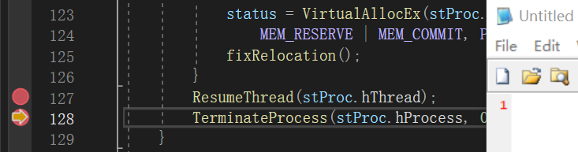

# PEPack
PEPack, just a demo project, cannot bypass anything ^_^  
Maybe we always also call this method process hollowing? 

Use files in fold shell to generate a unpacking program, 
then use files in addshell to generate a packing program. 

Tested in x64 platform, when resume the thread, program runs

